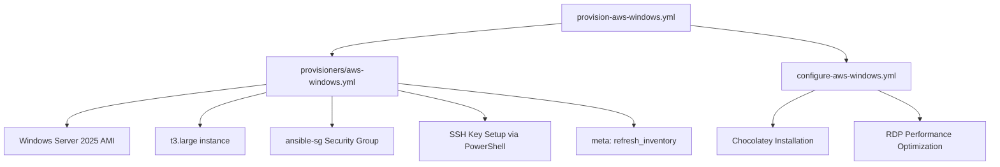

# System Patterns: Ansible All My Things

## Architecture Overview

### Multi-Provider Infrastructure System
**Current Architecture:**
```
Multi-Provider Infrastructure:
├── Hetzner Cloud Linux (hobbiton)     # Complete desktop development environment
├── AWS Linux (rivendell)              # On-demand development server  
└── AWS Windows (moria)                # Windows application server
```

**Cross-Provider Patterns:**
- **Multi-Source Inventory**: Dynamic inventory (AWS, Hetzner) plus static inventory (Vagrant)
- **Platform Grouping**: Consistent linux/windows grouping across all providers including test environments
- **SSH Key Management**: Single SSH key pair working across all environments
- **Idiomatic Secret Management**: Vault-encrypted variables in `inventories/group_vars/all/vars.yml`
- **Automated Vault Access**: `ansible.cfg` with `vault_password_file` for seamless secret handling
- **Unified Command Target**: Extending consistent `provision.yml` pattern to all environments

### Enhanced Inventory System
**Current Structure:**
```
inventories/
├── aws_ec2.yml                # AWS dynamic inventory
├── hcloud.yml                 # Hetzner Cloud dynamic inventory
├── vagrant_docker.yml         # Vagrant Docker static inventory for testing
├── vagrant_tart.yml           # Vagrant Tart static inventory for testing
├── group_vars/
│   ├── all/
│   │   ├── vars.yml           # Encrypted secrets (idiomatic location)
│   │   └── vault-template.yml # Secret documentation template
│   ├── linux/vars.yml         # Cross-provider Linux variables
│   ├── hcloud/vars.yml        # Hetzner provider-specific overrides
│   └── hcloud_linux/vars.yml  # Hetzner Linux-specific variables
├── requirements.txt           # Python dependencies for multi-provider support
└── requirements.yml           # Ansible collections for all providers
```

**Enhanced Inventory Patterns:**
- **Dual Group Structure**: Both cross-provider (@linux, @windows) and provider-specific (@hcloud_linux, @vagrant_docker) groups
- **Enhanced Targeting**: Fine-grained automation control with provider-specific groups including test environments
- **Improved Tag Semantics**: `platform: "linux"` instead of `ansible_group: "linux"` for clarity
- **Enhanced Variable Precedence**: all → platform → provider → provider_platform hierarchy including test providers
- **Dependency Management**: Streamlined setup with requirements files
- **Testing Integration**: Test environments follow same inventory patterns as production

### Current Cross-Provider Playbook Structure
```
Cross-Provider Patterns:
├── Production Environments:
│   ├── Hetzner Cloud Linux:  provision.yml → provisioners/hcloud.yml → configure.yml
│   ├── AWS Multi-Platform:   provision-aws-*.yml → provisioners/aws-*.yml → configure-*.yml
│   └── Unified Cleanup:      destroy.yml (Hetzner) / destroy-aws.yml (AWS)
└── Testing Environments (Current Gap):
    ├── Vagrant Docker:       vagrant up → configure-linux.yml (INCONSISTENT PATTERN)
    └── TARGET: Unified:      provision.yml --extra-vars "provider=vagrant_docker platform=linux"
```

**Separation of Concerns:**
- **Provision Layer**: Provider-specific infrastructure creation with platform-specific configurations
- **Configuration Layer**: Platform-specific system setup and application installation  
- **Unified Patterns**: Consistent structure across providers with provider-specific optimizations
- **Testing Layer**: Vagrant-based testing environments using same configuration patterns as production
- **Current Gap**: Vagrant environments need unified command pattern integration

### Multi-Provider Pattern (Implemented)
All implementations follow consistent structure with provider and platform-specific implementations:
```
Hetzner Cloud Linux:  provision.yml → configure.yml → destroy.yml
AWS Linux:            provision-aws-linux.yml → destroy-aws.yml
AWS Windows:          provision-aws-windows.yml → configure-aws-windows.yml → destroy-aws.yml
```

**Provider Abstraction Achieved:**
- **Common Interface**: Similar command patterns across providers
- **Provider-Specific Optimizations**: Each provider optimized for its strengths
- **Consistent Patterns**: Same architectural principles applied differently
- **Unified User Experience**: Predictable workflows regardless of provider

## Key Technical Decisions

### Cross-Provider Architecture Strategy (Achieved)
**Provider Abstraction**: Successfully implemented consistent patterns across AWS and Hetzner Cloud
- **Shared Patterns**: Dynamic inventory, SSH key management, platform-based grouping
- **Provider-Specific Optimizations**: AWS for on-demand, Hetzner Cloud for persistent environments
- **Consistent Interface**: Similar command patterns across all implementations

### Multi-Platform Extension Strategy (Achieved)
**Platform Adaptation**: Successfully extended Linux patterns to Windows Server
- **Shared AWS Infrastructure**: Reused security groups, networking, tagging patterns
- **Platform-Specific Configuration**: Windows-specific modules and PowerShell approaches
- **Consistent Interface**: Same command patterns for provision/configure/destroy achieved

### Provider-Specific Architecture Decisions (Implemented)

#### Hetzner Cloud Optimization Strategy
**Persistent Environment Model**: Optimized for long-term development use
- **Complete Desktop**: Full GNOME environment with comprehensive application suite
- **Backup/Restore**: Automated data persistence across reprovisioning cycles
- **Cost Optimization**: Predictable EU-based pricing at ~$4/month
- **User Experience**: Designed for daily development workflow

#### AWS Multi-Platform Strategy  
**On-Demand Model**: Optimized for intermittent usage patterns
- **Linux Foundation**: Minimal server setup with dynamic inventory patterns
- **Windows Extension**: Platform-specific adaptations within shared infrastructure
- **Cost Management**: Complete lifecycle automation to eliminate ongoing costs
- **Flexibility**: Both Linux and Windows platforms on same provider

#### Windows-Specific Implementation (AWS)
**Authentication Method**: SSH key-based authentication successfully implemented
```yaml
# Windows connection configuration (SSH implemented)
ansible_connection: ssh
ansible_user: Administrator
ansible_port: 22
ansible_shell_type: powershell
ansible_shell_executable: powershell
```

**Package Management**: Chocolatey successfully implemented
```yaml
# Windows package installation pattern (implemented)
- name: Install Chocolatey package manager
  win_shell: |
    Set-ExecutionPolicy Bypass -Scope Process -Force
    [System.Net.ServicePointManager]::SecurityProtocol = [System.Net.ServicePointManager]::SecurityProtocol -bor 3072
    iex ((New-Object System.Net.WebClient).DownloadString('https://community.chocolatey.org/install.ps1'))
  args:
    creates: C:\ProgramData\chocolatey\bin\choco.exe
```

### Implementation Specifications Across Providers

#### Hetzner Cloud Linux Technical Specifications
- **Instance**: cx22 (2 vCPU, 4GB RAM, 40GB SSD) in Helsinki
- **OS**: Ubuntu 24.04 LTS with full GNOME desktop environment
- **Authentication**: root → gandalf user with SSH key authentication
- **Cost**: ~$4/month with predictable EU-based pricing
- **Features**: Complete desktop applications, automated backup/restore system

#### AWS Linux Technical Specifications  
- **Instance**: t3.micro/small in eu-north-1
- **OS**: Ubuntu 24.04 LTS with minimal server setup
- **Authentication**: ubuntu → gandalf user with SSH key authentication
- **Cost**: ~$8-10/month with on-demand usage patterns
- **Features**: Basic development tools, dynamic inventory foundation

#### AWS Windows Technical Specifications
- **Instance**: t3.large (4 vCPU, 8GB RAM, 50GB GP3) in eu-north-1
- **OS**: Windows Server 2025 with Desktop Experience
- **Authentication**: Administrator with SSH key authentication via icacls
- **Cost**: ~$60/month with on-demand usage reducing actual costs
- **Features**: SSH + RDP access, Chocolatey package management, application framework

## Component Relationships

### Implemented Windows Server Provisioning Flow


### Implemented AWS Infrastructure Reuse
**Shared Components** (successfully reused from Linux):
- AWS credentials and authentication (working across platforms)
- Dynamic inventory plugin (`amazon.aws.aws_ec2`) (supports both platforms)
- Instance tagging and naming conventions (consistent across platforms)
- Security group patterns (extended for Windows ports)

**Windows-Specific Components** (successfully implemented):
- Windows Server 2025 AMI selection (ami-01998fe5b868df6e3)
- SSH (22) and RDP (3389) in shared security group
- OpenSSH Server configuration via PowerShell user data
- Larger instance types (t3.large for optimal performance)
- Windows-specific configuration with Chocolatey and RDP optimization

## Critical Implementation Paths

### Implemented Windows Server Provisioning Pattern
```yaml
# provisioners/aws-windows.yml (implemented and working)
- name: Launch Windows Server EC2 instance
  amazon.aws.ec2_instance:
    name: "{{ aws_instance_name }}"
    image_id: "{{ aws_ami_id }}"
    instance_type: "{{ aws_instance_type }}"
    key_name: "{{ aws_ssh_key_name }}"
    security_groups:
      - "{{ aws_security_group_name }}"
    user_data: |
      <powershell>
      # Set Administrator password
      $Password = ConvertTo-SecureString "{{ windows_admin_password }}" -AsPlainText -Force
      $UserAccount = Get-LocalUser -Name "Administrator"
      $UserAccount | Set-LocalUser -Password $Password

      # Enable RDP and OpenSSH Server
      Set-ItemProperty -Path 'HKLM:\System\CurrentControlSet\Control\Terminal Server' -name "fDenyTSConnections" -value 0
      Enable-NetFirewallRule -DisplayGroup "Remote Desktop"
      Set-Service -Name sshd -StartupType 'Automatic'
      Start-Service sshd

      # Configure SSH key authentication for Administrator
      $AdminSSHDir = "C:\ProgramData\ssh"
      $AdminAuthorizedKeysFile = "$AdminSSHDir\administrators_authorized_keys"
      $PublicKey = "{{ my_ssh_public_key }}"
      Set-Content -Path "$AdminAuthorizedKeysFile" -Value $PublicKey
      
      # Set correct permissions with icacls
      icacls $AdminSSHDir /inheritance:r
      icacls $AdminSSHDir /grant:r "Administrator:(OI)(CI)F"
      icacls $AdminSSHDir /grant:r "SYSTEM:(OI)(CI)F"
      icacls "$AdminAuthorizedKeysFile" /inheritance:r
      icacls "$AdminAuthorizedKeysFile" /grant:r "Administrator:F"
      icacls "$AdminAuthorizedKeysFile" /grant:r "SYSTEM:F"
      </powershell>
```

### Implemented Windows Configuration Pattern
```yaml
# configure-aws-windows.yml (implemented and working)
- name: Configure RDP settings for better performance
  win_shell: |
    Set-ItemProperty -Path "HKLM:\SYSTEM\CurrentControlSet\Control\Terminal Server\WinStations\RDP-Tcp" -Name "ColorDepth" -Value 4 -Type DWord
    Set-ItemProperty -Path "HKLM:\SYSTEM\CurrentControlSet\Control\Terminal Server\WinStations\RDP-Tcp" -Name "fDisableClip" -Value 0 -Type DWord

- name: Install Chocolatey package manager
  win_shell: |
    Set-ExecutionPolicy Bypass -Scope Process -Force
    [System.Net.ServicePointManager]::SecurityProtocol = [System.Net.ServicePointManager]::SecurityProtocol -bor 3072
    iex ((New-Object System.Net.WebClient).DownloadString('https://community.chocolatey.org/install.ps1'))
  args:
    creates: C:\ProgramData\chocolatey\bin\choco.exe
```

## Design Principles

### Achieved Windows Server Adaptation Principles
- **Consistency**: Same command patterns as Linux implementation ✅ ACHIEVED
- **Reuse**: Leveraged existing AWS infrastructure patterns ✅ ACHIEVED
- **Simplicity**: Minimal Windows-specific configuration ✅ ACHIEVED
- **Cost Awareness**: Optimized for intermittent usage patterns ✅ ACHIEVED

### Implemented Security Model for Windows
- **SSH Access**: Restricted to user's IP address only (port 22) ✅ IMPLEMENTED
- **RDP Access**: Restricted to user's IP address only (port 3389) ✅ IMPLEMENTED
- **Windows Firewall**: Configured for minimal exposure via PowerShell ✅ IMPLEMENTED
- **User Authentication**: Administrator account with SSH key authentication ✅ IMPLEMENTED
- **Credential Management**: SSH keys and Windows passwords via Ansible Vault ✅ IMPLEMENTED

### Achieved Cost Optimization Strategy
- **On-Demand Usage**: Complete provision → use → destroy lifecycle ✅ IMPLEMENTED
- **Instance Sizing**: t3.large for optimal Windows Server GUI performance ✅ IMPLEMENTED
- **Storage Optimization**: 50GB GP3 for cost-effectiveness ✅ IMPLEMENTED
- **Usage Patterns**: On-demand sessions significantly reduce costs ✅ ACHIEVED

## Extension Points

### Enhanced Inventory System (Completed Implementation)
**Completed Enhancement Features:**
1. **Dual Keyed Groups**: Cross-provider platform groups (@linux, @windows) plus provider-specific groups (@aws_ec2_linux, @hcloud_linux)
2. **Improved Tag Semantics**: Changed from `ansible_group` to `platform` tags for clearer automation intent
3. **Enhanced Variable Structure**: Four-tier precedence (all → platform → provider → provider_platform)
4. **Group Vars Reorganization**: Provider directories renamed (aws → aws_ec2) and provider-platform directories added
5. **Provisioner Updates**: All provisioners updated to use new platform tag semantics
6. **Backward Compatibility**: Existing playbooks continue working while new targeting capabilities available

**Achieved Group Structure:**
```
@all:
  |--@aws_ec2:              # Provider group (automatic)
  |  |--moria
  |  |--rivendell
  |--@aws_ec2_linux:        # Provider-platform group (enhanced)
  |  |--rivendell
  |--@aws_ec2_windows:      # Provider-platform group (enhanced)
  |  |--moria
  |--@hcloud:               # Provider group (automatic)
  |  |--hobbiton
  |--@hcloud_linux:         # Provider-platform group (enhanced)
  |  |--hobbiton
  |--@linux:                # Cross-provider platform group (maintained)
  |  |--hobbiton
  |  |--rivendell
  |--@windows:              # Cross-provider platform group (maintained)
  |  |--moria
```

**Enhanced Variable Precedence Strategy:**
- `all` → `platform` (linux/windows) → `provider` (aws_ec2/hcloud) → `provider_platform` (aws_ec2_linux, hcloud_linux, aws_ec2_windows)
- Handles admin user differences: AWS Linux (ubuntu), Hetzner Linux (root), AWS Windows (Administrator)
- Enhanced granularity for provider-specific automation while maintaining cross-provider capabilities

### Future Extension Opportunities
**Additional Vagrant Providers**: Extend unified command pattern to Vagrant Tart and other providers
**Enhanced Testing**: Automated test suites leveraging unified command patterns
**CI/CD Integration**: Unified provisioning in continuous integration workflows
**Monitoring Integration**: Comprehensive infrastructure monitoring across providers

## Provider Differences Reference (Focus Areas)

| Aspect | Hetzner Linux | Vagrant Docker | Current Gap |
|--------|---------------|----------------|-------------|
| Connection | SSH (port 22) | SSH (port 22) | Same pattern |
| Default User | `root` | `vagrant` | Variable handling |
| Package Manager | APT | APT | Same |
| Provisioning | `provision.yml` | `vagrant up` | **INCONSISTENT** |
| Cost | ~$4/month | Free | Cost leader vs free testing |
| Inventory Groups | @hcloud, @hcloud_linux, @linux | @vagrant_docker, @vagrant_docker_linux, @linux | Target pattern |

## Key Technical Patterns for Current MVP

### Ansible Collections (Relevant)
```yaml
# Required collections for current focus
collections:
  - name: hetzner.hcloud    # Hetzner Cloud support
  - name: community.general # General utilities
```

### Vagrant Docker Integration Pattern (Target)
```yaml
# Target: provision.yml support for Vagrant Docker
- name: Handle Vagrant Docker provisioning
  include_tasks: provisioners/vagrant_docker-linux.yml
  when: provider == "vagrant_docker" and platform == "linux"
```
