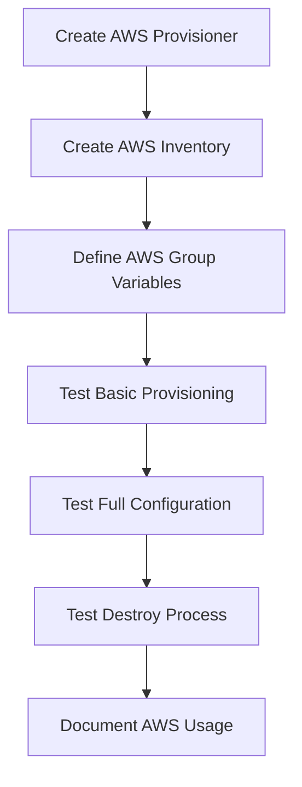

# Active Context: Ansible All My Things

## Current Work Focus

### Review Findings Resolution
**Primary Objective**: Fix critical findings discovered in AWS implementation:
- ✅ **AWS Provisioning Idempotency**: Fixed - provision-aws.yml now maintains exactly one instance using "lorien" identifier
- ✅ **AWS Inventory Discovery**: Fixed - simplified inventory configuration to match correct region and follow Hetzner pattern
- ✅ **Development Environment Packages**: python3-full and ansible-core already present in setup-desktop.yml (benefits all environments)
- ✅ **AWS Documentation**: Fixed - resolved markdown violations and added "Notes on Performance" section matching Hetzner pattern
- ✅ **Merge MVP Documentation**: MVP directory not found - likely already integrated or removed
- ✅ **Cleanup MVP Directory**: MVP directory not present - cleanup already completed
- ✅ **AWS Host Key Cleanup**: RESOLVED - destroy-aws.yml now removes host keys from known_hosts file

**Status**: All 7 critical findings resolved ✅

### Recently Resolved: AWS Host Key Cleanup
**Issue**: During AWS provisioning testing, discovered that `destroy-aws.yml` did not remove host keys from local known_hosts file, unlike `destroy.yml` (Hetzner) which properly cleans up host keys before server destruction.

**Impact**: Users could encounter SSH host key warnings when recreating AWS instances that receive previously used IP addresses.

**Root Cause**: `destroy-aws.yml` jumped straight to instance termination without the host key cleanup step that exists in `destroy.yml`.

**Solution Implemented**: Added host key removal step to `destroy-aws.yml` that:
- ✅ Extracts IP addresses from instances before termination using `public_ip_address` attribute
- ✅ Uses `ssh-keygen -R` to remove each IP from known_hosts via shell command
- ✅ Handles multiple instances (unlike Hetzner's single server approach) with loop iteration
- ✅ Maintains parity with Hetzner implementation pattern
- ✅ Includes proper error handling with `ignore_errors: true` for missing host keys
- ✅ Filters out undefined/empty IP addresses to prevent errors

**Approach**: Fix one finding per commit with user review between fixes

**Solutions Implemented**:
- **Idempotency**: Used fixed instance identifier "lorien" with proper ec2_instance_info checks
- **Inventory Discovery**: Simplified configuration, fixed region mismatch (eu-north-1), removed complexity
- **Documentation**: Fixed markdown violations and enhanced "Notes on Performance" section with provider-specific file references

### MVP AWS Development Environment (Background Context)
**Objective**: Create secure, isolated AWS EC2 environments that provide:
- **Cross-Architecture Access**: Enable amd64 development from Apple Silicon (arm64) host systems
- **Secure Testing Environment**: Isolated environment for untrusted software (LLMs with MCP support)
- **Windows Foundation**: Linux implementation as stepping stone to Windows Server support
- **Cost Efficiency**: 10-15 minute provisioning with complete resource cleanup

**Long-term Vision**: Extend to Windows Server instances for Windows-specific development tools unavailable on macOS/Linux.

### Key Requirements for AWS MVP
- **Architecture**: amd64 (x86_64) to run tools unavailable on Apple Silicon
- **Instance Type**: t3.micro or t3.small (cost-effective, free tier eligible)
- **Operating System**: Ubuntu 24.04 LTS (current), Windows Server (future)
- **Storage**: 20GB GP3 EBS volume
- **Network**: Default VPC with SSH access from user's IP
- **Lifecycle**: Complete provision → configure → destroy cycle
- **Cost Target**: ~$8-10/month maximum (only when actively used)

## Recent Changes & Discoveries

### AWS Implementation Completed
- **AWS EC2 Provisioner**: Created `provisioners/aws-ec2.yml` with security group management
- **Dynamic Inventory**: Implemented `inventories/aws/aws_ec2.yml` for automatic host discovery
- **Simplified Configuration**: Minimal AWS-specific variables following Hetzner pattern
- **Complete Lifecycle**: Provision, configure, and destroy playbooks implemented
- **Cross-Architecture Documentation**: Updated use case and project brief for amd64 access

### Architecture Improvements Made
- **Configuration Minimalism**: Reduced AWS variables from 64 lines to essential 3 settings
- **Standardized Structure**: Updated provision.yml to match provision-aws.yml format
- **Core Architecture Drivers**: Established understandability, maintainability, extensibility
- **Quality Conflict Resolution**: Added guidance for handling competing design priorities
- **Provider Consistency**: Ensured identical patterns across Hetzner and AWS implementations

### Current Architecture Strengths
- **Provider Abstraction**: Clean separation between provisioning and configuration
- **Security Model**: Ansible Vault encryption, SSH key management, no hardcoded secrets
- **Testing Strategy**: Multi-provider testing ensures compatibility
- **Modular Design**: Individual playbooks for specific functionality
- **Configuration Simplicity**: Minimal provider-specific overrides for maintainability

## Next Steps

### Primary Priorities (AWS MVP Ready for Testing)
- **Test Integration**: Ensure existing playbooks work with AWS instances
- **Windows Planning**: Research Windows Server AMIs and configuration requirements
- **Performance Validation**: Verify 10-15 minute provision time target
- **Cost Validation**: Confirm ~$8-10/month cost target for typical usage

### Completed Review Findings (All 6 Critical Issues Resolved)
1. ✅ **AWS Provisioning Idempotency**: Fixed using "lorien" identifier with proper ec2_instance_info checks
2. ✅ **AWS Inventory Discovery**: Simplified configuration, fixed region mismatch (eu-north-1), removed complexity
3. ✅ **Development Environment Packages**: python3-full and ansible-core already present in setup-desktop.yml
4. ✅ **AWS Documentation**: Fixed markdown violations and enhanced "Notes on Performance" section
5. ✅ **Merge MVP Documentation**: MVP directory not found - likely already integrated or removed
6. ✅ **Cleanup MVP Directory**: MVP directory not present - cleanup already completed

### Implementation Sequence

### Technical Decisions Needed
- **AWS Region**: Default to eu-north-1 or allow configuration?
- **Instance Naming**: Follow existing naming conventions
- **Security Groups**: Create dedicated or use default?
- **Key Pair Management**: Auto-generate or use existing?

## Active Patterns & Preferences

### Established Conventions
- **File Naming**: `setup-[functionality].yml` for configuration playbooks
- **Variable Naming**: `admin_user_on_fresh_system`, `ansible_user`, `my_desktop_user`
- **Directory Structure**: Provider-specific under `inventories/` and `provisioners/`
- **Testing Approach**: Local Vagrant testing before cloud deployment

### Code Quality Standards
- **Idempotency**: All tasks must be safely re-runnable
- **Error Handling**: Clear error messages for missing credentials
- **Documentation**: Inline comments for complex operations
- **Security**: No secrets in playbooks, all encrypted with Vault

### Integration Patterns
- **Dynamic Inventory**: Provider plugins for automatic host discovery
- **Group Variables**: Provider-specific configuration in `group_vars/`
- **Conditional Logic**: Provider-aware task execution
- **Symmetric Operations**: Backup/restore pairs for all configurations

## Important Learnings & Insights

### Multi-Provider Challenges
- **Admin Users**: Each provider has different initial admin user (root, admin, vagrant)
- **Desktop Support**: Docker containers cannot run desktop environments
- **Network Configuration**: Provider-specific networking requirements
- **Cost Management**: Critical to have reliable destroy operations

### Ansible Best Practices Discovered
- **Early User Creation**: Switch from admin to ansible user immediately
- **SSH Key Management**: Automated key pair creation and distribution
- **Vault Integration**: Seamless encryption without manual password entry
- **Testing Strategy**: Multiple provider testing catches edge cases

### Security Considerations
- **Credential Isolation**: Environment variables for provider authentication
- **Access Control**: Minimal privilege escalation, sudo only when needed
- **Network Security**: SSH-only access, no password authentication
- **Data Protection**: All sensitive data encrypted at rest

## Current Challenges

### AWS Integration Unknowns
- **Collection Requirements**: Need to verify `amazon.aws` collection compatibility
- **Authentication Flow**: AWS credentials vs. Hetzner token approach
- **Instance Discovery**: Dynamic inventory configuration for EC2
- **Cost Monitoring**: Ensuring complete resource cleanup

### Testing Considerations
- **AWS Costs**: Need to minimize testing costs during development
- **Credential Management**: Secure handling of AWS credentials in testing
- **Provider Parity**: Ensuring AWS behaves identically to Hetzner
- **Documentation**: Clear setup instructions for AWS credentials

## Context for Future Work

### Extension Opportunities
- **Windows Server Support**: AWS EC2 Windows instances for Windows-specific development
- **Additional Providers**: Google Cloud, DigitalOcean, Azure
- **Enhanced Security**: Advanced hardening, monitoring, logging
- **Application Support**: Additional development tools and applications
- **Automation**: CI/CD integration, scheduled operations

### Maintenance Considerations
- **Provider API Changes**: Monitor for breaking changes in cloud APIs
- **Ubuntu Updates**: Track LTS releases and migration paths
- **Ansible Evolution**: Stay current with Ansible and collection updates
- **Security Updates**: Regular review of security practices

### User Experience Goals
- **Cross-Architecture Transparency**: Seamless amd64 access from Apple Silicon host
- **Platform Flexibility**: Easy switching between Linux and Windows environments
- **Simplicity**: Single command provisioning across all providers
- **Reliability**: Consistent behavior regardless of provider choice
- **Transparency**: Clear feedback on operations and costs
- **Cost Awareness**: Clear understanding of architectural benefits vs. costs

## Memory Bank Maintenance Notes
- **Last Updated**: All 6 critical review findings resolved (December 21, 2025)
- **Next Review**: After AWS MVP testing phase completion
- **Key Files to Monitor**: AWS implementation files ready for integration testing
- **Success Metrics**: 10-15 minute provision time, zero ongoing costs, identical UX to Hetzner
- **Recent Changes**: All critical findings resolved - AWS MVP ready for testing phase
