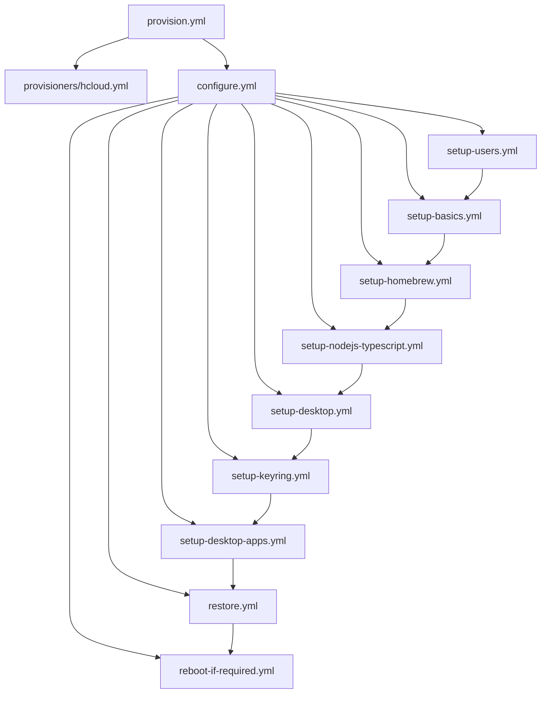

# System Patterns: Ansible All My Things

## Architecture Overview

### Layered Playbook Structure
```
provision.yml → provisioners/[provider].yml → configure.yml → playbooks/setup-*.yml
```

**Separation of Concerns:**
- **Provision Layer**: Provider-specific infrastructure creation
- **Configuration Layer**: Provider-agnostic system setup
- **Playbook Layer**: Specific functionality (users, desktop, apps)

### Multi-Provider Pattern
Each provider follows identical structure but different implementations:
```
inventories/
├── hcloud/          # Hetzner Cloud
│   ├── hcloud.yml   # Dynamic inventory
│   └── group_vars/dev/vars.yml
├── aws/             # AWS EC2 (planned)
└── local/           # Vagrant testing
```

## Key Technical Decisions

### User Management Strategy
**Three-Tier User Model:**
1. **Admin User**: Provider-specific initial user (`root`, `admin`, `vagrant`)
2. **Ansible User**: Consistent automation user across all providers
3. **Desktop User**: Human user for interactive work

**Implementation Pattern:**
```yaml
# Early in setup-users.yml
- name: Create ansible user with sudo privileges
  user:
    name: "{{ ansible_user }}"
    groups: sudo
    shell: /bin/bash
    create_home: yes

# Switch to ansible_user for all subsequent operations
```

### Credential Management Architecture
**Ansible Vault Integration:**
- All secrets in `/playbooks/vars-secrets.yml` (encrypted)
- Vault password in `/ansible-vault-password.txt` (gitignored)
- Provider credentials via environment variables

**Security Boundaries:**
- No secrets in version control
- Encrypted at rest (Ansible Vault)
- Environment-based provider authentication
- SSH key-based system access

### Configuration Management Patterns

#### Idempotent Operations
All playbooks designed for multiple runs without side effects:
```yaml
- name: Install package
  apt:
    name: "{{ package_name }}"
    state: present
    update_cache: yes
```

#### Conditional Provider Support
```yaml
# Desktop setup only where supported
- import_playbook: playbooks/setup-desktop.yml
  when: ansible_virtualization_type != "docker"
```

#### Backup/Restore Symmetry
Every configuration change has corresponding backup/restore:
- `backup-*.yml` → `restore-*.yml`
- Stored in `configuration/home/{{ my_desktop_user }}/`

## Component Relationships

### Core Playbook Dependencies


### Inventory Integration Pattern
```yaml
# Dynamic inventory (hcloud.yml)
plugin: hetzner.hcloud.hcloud
regions:
  - eu-central
types:
  - cx11

# Group variables (group_vars/dev/vars.yml)
admin_user_on_fresh_system: root
ansible_user: ansible
my_desktop_user: myuser
```

## Critical Implementation Paths

### Provider Onboarding Pattern
1. **Create Provisioner**: `provisioners/[provider].yml`
2. **Create Inventory**: `inventories/[provider]/`
3. **Set Group Variables**: Provider-specific admin user
4. **Test Integration**: Vagrant-based local testing first

### Backup/Restore Implementation
**Symmetric Operations:**
```yaml
# Backup pattern
- name: Create backup directory
  file:
    path: "{{ backup_path }}"
    state: directory

- name: Copy configuration files
  copy:
    src: "{{ source_path }}"
    dest: "{{ backup_path }}"
    remote_src: yes

# Restore pattern (reverse operation)
- name: Restore configuration files
  copy:
    src: "{{ backup_path }}"
    dest: "{{ source_path }}"
    remote_src: yes
```

### Testing Strategy Pattern
**Multi-Level Testing:**
1. **Unit**: Individual playbook testing with Vagrant
2. **Integration**: Full provision → configure → destroy cycle
3. **Provider**: Test across all supported providers

**Test Environment Structure:**
```
test/
├── docker/     # Minimal testing (no desktop)
├── tart/       # macOS VM testing
└── vagrant/    # VirtualBox testing
```

## Design Principles

### Provider Abstraction
- Common playbooks work across all providers
- Provider-specific code isolated to provisioners/
- Inventory variables handle provider differences

### Fail-Fast Philosophy
- Early user creation and SSH key setup
- Immediate switch from admin to ansible user
- Clear error messages for missing credentials

### Cost Optimization
- Complete resource lifecycle management
- No persistent infrastructure by default
- Automatic cleanup on destroy operations

### Security by Default
- All secrets encrypted
- No root user operations after initial setup
- SSH key-based authentication only
- Minimal privilege escalation

## Extension Points

### Adding New Providers
1. Create `provisioners/[provider].yml`
2. Create `inventories/[provider]/`
3. Define `admin_user_on_fresh_system` variable
4. Test with existing playbooks

### Adding New Applications
1. Create `playbooks/setup-[app].yml`
2. Create corresponding `backup-[app].yml` and `restore-[app].yml`
3. Add to `configure.yml` and `backup.yml`
4. Test across all providers

### Adding New Environments
1. Create inventory group in `group_vars/`
2. Define environment-specific variables
3. Test provision → configure → destroy cycle
