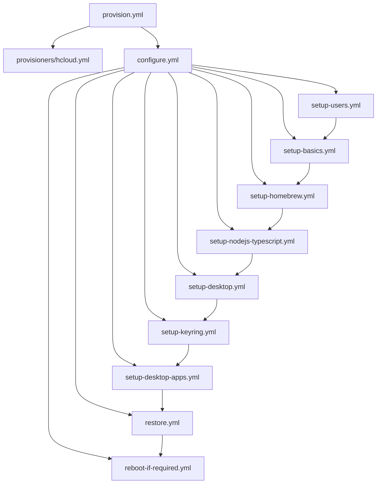

# System Patterns: Ansible All My Things

## Architecture Overview

### Layered Playbook Structure
```
provision.yml → provisioners/[provider].yml → configure.yml → playbooks/setup-*.yml
```

**Separation of Concerns:**
- **Provision Layer**: Provider-specific infrastructure creation
- **Configuration Layer**: Provider-agnostic system setup
- **Playbook Layer**: Specific functionality (users, desktop, apps)

### Multi-Provider Pattern
Each provider follows identical structure but different implementations:
```
inventories/
├── hcloud/          # Hetzner Cloud
│   ├── hcloud.yml   # Dynamic inventory
│   └── group_vars/dev/vars.yml
├── aws/             # AWS EC2
│   ├── aws_ec2.yml  # Dynamic inventory
│   └── group_vars/aws_dev/vars.yml
└── local/           # Vagrant testing
```

### AWS Implementation Pattern
Following the established Hetzner pattern with AWS-specific adaptations:
```
provision-aws.yml → provisioners/aws-ec2.yml → configure-aws.yml → playbooks/setup-*.yml
```

**AWS-Specific Considerations:**
- **Authentication**: AWS credentials via environment variables (vs. HCLOUD_TOKEN)
- **Inventory Plugin**: `amazon.aws.aws_ec2` (vs. `hetzner.hcloud.hcloud`)
- **Instance Module**: `amazon.aws.ec2_instance` (vs. `hetzner.hcloud.server`)
- **Default User**: `ubuntu` (vs. `root` for Hetzner)
- **Networking**: Security group creation required (vs. automatic for Hetzner)
- **Tagging**: AWS tags (vs. Hetzner labels)

**Proven AWS Patterns (Implemented and Working):**
- **Idempotency Pattern**: Use fixed instance identifier ("lorien") with `ec2_instance_info` checks before creation
- **Inventory Simplification**: Minimal configuration following Hetzner pattern, avoid complex grouping/filtering
- **Region Consistency**: Use single region (eu-north-1) consistently across provisioner and inventory
- **Hostname Configuration**: Use `tag:Name` as primary hostname source with `public-ip-address` as fallback

## Key Technical Decisions

### User Management Strategy
**Three-Tier User Model:**
1. **Admin User**: Provider-specific initial user (`root`, `admin`, `vagrant`)
2. **Ansible User**: Consistent automation user across all providers
3. **Desktop User**: Human user for interactive work

**Implementation Pattern:**
```yaml
# Early in setup-users.yml
- name: Create ansible user with sudo privileges
  user:
    name: "{{ ansible_user }}"
    groups: sudo
    shell: /bin/bash
    create_home: yes

# Switch to ansible_user for all subsequent operations
```

### Credential Management Architecture
**Ansible Vault Integration:**
- All secrets in `/playbooks/vars-secrets.yml` (encrypted)
- Vault password in `/ansible-vault-password.txt` (gitignored)
- Provider credentials via environment variables

**Security Boundaries:**
- No secrets in version control
- Encrypted at rest (Ansible Vault)
- Environment-based provider authentication
- SSH key-based system access

### Configuration Management Patterns

#### Idempotent Operations
All playbooks designed for multiple runs without side effects:
```yaml
- name: Install package
  apt:
    name: "{{ package_name }}"
    state: present
    update_cache: yes
```

#### Conditional Provider Support
```yaml
# Desktop setup only where supported
- import_playbook: playbooks/setup-desktop.yml
  when: ansible_virtualization_type != "docker"
```

#### Backup/Restore Symmetry
Every configuration change has corresponding backup/restore:
- `backup-*.yml` → `restore-*.yml`
- Stored in `configuration/home/{{ my_desktop_user }}/`

## Component Relationships

### Core Playbook Dependencies


### Inventory Integration Pattern
```yaml
# Dynamic inventory (hcloud.yml)
plugin: hetzner.hcloud.hcloud
regions:
  - eu-central
types:
  - cx11

# Group variables (group_vars/dev/vars.yml)
admin_user_on_fresh_system: root
ansible_user: ansible
my_desktop_user: myuser
```

## Critical Implementation Paths

### Provider Onboarding Pattern
1. **Create Provisioner**: `provisioners/[provider].yml`
2. **Create Inventory**: `inventories/[provider]/`
3. **Set Group Variables**: Provider-specific admin user and configuration
4. **Create Main Playbooks**: `provision-[provider].yml`, `configure-[provider].yml`, `destroy-[provider].yml`
5. **Test Integration**: Vagrant-based local testing first

### AWS Provider Implementation
**Required AWS Permissions:**
```json
{
    "Version": "2012-10-17",
    "Statement": [
        {
            "Effect": "Allow",
            "Action": [
                "ec2:RunInstances", "ec2:TerminateInstances", "ec2:DescribeInstances",
                "ec2:DescribeImages", "ec2:DescribeKeyPairs", "ec2:DescribeSecurityGroups",
                "ec2:CreateSecurityGroup", "ec2:DeleteSecurityGroup",
                "ec2:AuthorizeSecurityGroupIngress", "ec2:CreateTags", "ec2:DescribeTags"
            ],
            "Resource": "*"
        }
    ]
}
```

**Environment Setup:**
```bash
export AWS_ACCESS_KEY_ID="your-access-key"
export AWS_SECRET_ACCESS_KEY="your-secret-key"
export AWS_DEFAULT_REGION="eu-north-1"
```

### Backup/Restore Implementation
**Symmetric Operations:**
```yaml
# Backup pattern
- name: Create backup directory
  file:
    path: "{{ backup_path }}"
    state: directory

- name: Copy configuration files
  copy:
    src: "{{ source_path }}"
    dest: "{{ backup_path }}"
    remote_src: yes

# Restore pattern (reverse operation)
- name: Restore configuration files
  copy:
    src: "{{ backup_path }}"
    dest: "{{ source_path }}"
    remote_src: yes
```

### Testing Strategy Pattern
**Multi-Level Testing:**
1. **Unit**: Individual playbook testing with Vagrant
2. **Integration**: Full provision → configure → destroy cycle
3. **Provider**: Test across all supported providers

**Test Environment Structure:**
```
test/
├── docker/     # Minimal testing (no desktop)
├── tart/       # macOS VM testing
└── vagrant/    # VirtualBox testing
```

## Design Principles

### Core Architecture Drivers
- **Understandability**: Code and configuration should be self-documenting and easy to comprehend
- **Maintainability**: Minimize complexity, reduce configuration parameters to essentials only
- **Extensibility**: Design for easy addition of new providers, applications, and environments

### Provider Abstraction
- Common playbooks work across all providers
- Provider-specific code isolated to provisioners/
- Inventory variables handle provider differences
- Minimal provider-specific overrides (follow Hetzner pattern)

### Fail-Fast Philosophy
- Early user creation and SSH key setup
- Immediate switch from admin to ansible user
- Clear error messages for missing credentials

### Cost Optimization
- Complete resource lifecycle management
- No persistent infrastructure by default
- Automatic cleanup on destroy operations

### Security by Default
- All secrets encrypted
- No root user operations after initial setup
- SSH key-based authentication only
- Minimal privilege escalation

### Configuration Minimalism
- Keep only essential provider-specific differences in group_vars
- Avoid unnecessary configuration parameters
- Default to sensible values rather than exposing every option
- Prefer convention over configuration

### Quality Criteria Conflict Resolution
- **Identify Trade-offs**: When quality criteria conflict (e.g., extensibility vs. simplicity), explicitly identify the tension
- **Communicate Conflicts**: Inform users about competing priorities that could lead to unclear design decisions
- **Document Decisions**: Record which quality criterion takes precedence and why
- **Examples of Common Conflicts**:
  - Extensibility vs. Understandability (more options vs. simpler configuration)
  - Maintainability vs. Performance (cleaner code vs. optimized execution)
  - Security vs. Usability (strict controls vs. ease of use)
  - Cost Optimization vs. Reliability (minimal resources vs. redundancy)

## Lessons Learned from AWS Implementation

### AWS-Specific Implementation Insights
- **Fixed Instance Identifiers**: Using dynamic names (like timestamps) breaks idempotency; fixed identifiers ("lorien") with proper existence checks work reliably
- **Inventory Simplification**: Complex inventory configurations with multiple regions/filters create maintenance burden; minimal configuration following established patterns is more reliable
- **Region Consistency**: Mismatched regions between provisioner and inventory cause discovery failures; use single region consistently
- **Hostname Display**: Using IP addresses as hostnames reduces readability; tag-based hostnames with IP fallback provides better user experience

### Development Environment Packages
- **Universal Packages**: `python3-full` and `ansible-core` are beneficial for all environments, not just AWS-specific ones
- **Package Strategy**: Add generally useful packages to all environments rather than creating provider-specific conditionals

### Commit Strategy Effectiveness
- **Sequential Fixes**: Fixing one issue per commit with user review between fixes prevents compound problems
- **Clear Commit Messages**: Conventional commit format with detailed descriptions helps track progress and understand changes
- **Status Tracking**: Maintaining accurate status of what's resolved vs. what remains prevents confusion and duplicate work

## Extension Points

### Adding New Providers
1. Create `provisioners/[provider].yml`
2. Create `inventories/[provider]/`
3. Define `admin_user_on_fresh_system` variable
4. Create main playbooks (`provision-[provider].yml`, `configure-[provider].yml`, `destroy-[provider].yml`)
5. Test with existing playbooks

### Provider Differences Reference
| Aspect | Hetzner Cloud | AWS EC2 |
|--------|---------------|---------|
| Inventory Plugin | `hetzner.hcloud.hcloud` | `amazon.aws.aws_ec2` |
| Instance Module | `hetzner.hcloud.server` | `amazon.aws.ec2_instance` |
| Default User | `root` | `ubuntu` |
| SSH Key | Hetzner SSH key name | AWS key pair name |
| Networking | Automatic | Security group required |
| Tagging | Labels | Tags |
| Cost Model | Hourly billing | Per-second billing (min 60s) |
| Authentication | `HCLOUD_TOKEN` | AWS credentials |

### Adding New Applications
1. Create `playbooks/setup-[app].yml`
2. Create corresponding `backup-[app].yml` and `restore-[app].yml`
3. Add to `configure.yml` and `backup.yml`
4. Test across all providers

### Adding New Environments
1. Create inventory group in `group_vars/`
2. Define environment-specific variables
3. Test provision → configure → destroy cycle
