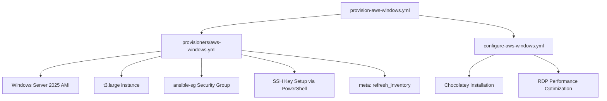

# System Patterns: Ansible All My Things

## Architecture Overview

### Unified Inventory System (Next Implementation)
**Target Structure:**
```
inventories/
├── aws.yml                    # AWS dynamic inventory
├── hcloud.yml                 # Hetzner Cloud dynamic inventory  
└── group_vars/
    ├── all/vars.yml           # Global variables (merged common vars)
    ├── linux/vars.yml         # Linux-specific variables (merged)
    └── windows/vars.yml       # Windows-specific variables (merged)
```

**Unified Inventory Pattern (Planned):**
- **Single Command**: `ansible-inventory --graph` shows all instances across providers
- **Platform Grouping**: Instances grouped by linux/windows only
- **Simplified Structure**: No provider-specific groups or directories
- **Consolidated Variables**: Common variables merged into group_vars/all/

### Implemented Layered Playbook Structure
```
provision-aws-windows.yml → provisioners/aws-windows.yml → configure-aws-windows.yml
provision-aws-linux.yml → provisioners/aws-linux.yml → configure-aws.yml
destroy-aws.yml → [unified cleanup for both platforms]
```

**Separation of Concerns (Achieved):**
- **Provision Layer**: AWS-specific infrastructure creation with platform-specific configurations
- **Configuration Layer**: Platform-specific system setup and application installation
- **Unified Cleanup**: Single destroy playbook handles both Linux and Windows resources

### Multi-Platform Pattern (Implemented)
Both platforms follow consistent structure with platform-specific implementations:
```
Linux (Production):   provision-aws-linux.yml → configure-aws.yml
Windows (Production): provision-aws-windows.yml → configure-aws-windows.yml
Cleanup (Unified):    destroy-aws.yml → [handles both platforms]
```

## Key Technical Decisions

### Windows Server Implementation Strategy (Achieved)
**Foundation Reuse**: Successfully extended AWS Linux patterns to Windows Server
- **Shared AWS Infrastructure**: Reused security groups, networking, tagging patterns
- **Platform-Specific Configuration**: Windows-specific modules and PowerShell approaches
- **Consistent Interface**: Same command patterns for provision/configure/destroy achieved

### Windows-Specific Architecture Decisions (Implemented)
**Authentication Method**: SSH key-based authentication successfully implemented
```yaml
# Windows connection configuration (SSH implemented)
ansible_connection: ssh
ansible_user: Administrator
ansible_port: 22
ansible_shell_type: powershell
ansible_shell_executable: powershell
```

**User Management Strategy**: Windows Administrator model with SSH keys
- **Administrator**: SSH key authentication via icacls permissions
- **PowerShell Integration**: Windows PowerShell as default SSH shell
- **Security**: SSH key-based access with proper Windows permissions

**Package Management**: Chocolatey successfully implemented
```yaml
# Windows package installation pattern (implemented)
- name: Install Chocolatey package manager
  win_shell: |
    Set-ExecutionPolicy Bypass -Scope Process -Force
    [System.Net.ServicePointManager]::SecurityProtocol = [System.Net.ServicePointManager]::SecurityProtocol -bor 3072
    iex ((New-Object System.Net.WebClient).DownloadString('https://community.chocolatey.org/install.ps1'))
  args:
    creates: C:\ProgramData\chocolatey\bin\choco.exe
```

### Implemented Technical Specifications for Windows Server

#### Instance Configuration (Achieved)
- **AMI**: Windows Server 2025 with Desktop Experience (ami-01998fe5b868df6e3)
- **Instance Type**: t3.large (4 vCPU, 8GB RAM) for optimal performance
- **Storage**: 50GB GP3 EBS optimized for Windows requirements
- **Region**: eu-north-1 (carbon footprint and latency optimization)

#### Network Configuration (Implemented)
- **Security Group**: Shared `ansible-sg` for both Linux and Windows
- **SSH Access**: Port 22 from user's current public IP only
- **RDP Access**: Port 3389 from user's current public IP only
- **Outbound**: Full internet access for downloads and updates

#### Authentication (Implemented)
- **Method**: SSH key-based authentication for Administrator account
- **SSH**: OpenSSH Server automatically configured via PowerShell user data
- **RDP**: Administrator account with RDP access enabled
- **Ansible**: SSH connection with PowerShell shell integration
- **Security**: SSH keys with proper Windows permissions via icacls

## Component Relationships

### Implemented Windows Server Provisioning Flow


### Implemented AWS Infrastructure Reuse
**Shared Components** (successfully reused from Linux):
- AWS credentials and authentication (working across platforms)
- Dynamic inventory plugin (`amazon.aws.aws_ec2`) (supports both platforms)
- Instance tagging and naming conventions (consistent across platforms)
- Security group patterns (extended for Windows ports)

**Windows-Specific Components** (successfully implemented):
- Windows Server 2025 AMI selection (ami-01998fe5b868df6e3)
- SSH (22) and RDP (3389) in shared security group
- OpenSSH Server configuration via PowerShell user data
- Larger instance types (t3.large for optimal performance)
- Windows-specific configuration with Chocolatey and RDP optimization

## Critical Implementation Paths

### Implemented Windows Server Provisioning Pattern
```yaml
# provisioners/aws-windows.yml (implemented and working)
- name: Launch Windows Server EC2 instance
  amazon.aws.ec2_instance:
    name: "{{ aws_instance_name }}"
    image_id: "{{ aws_ami_id }}"
    instance_type: "{{ aws_instance_type }}"
    key_name: "{{ aws_ssh_key_name }}"
    security_groups:
      - "{{ aws_security_group_name }}"
    user_data: |
      <powershell>
      # Set Administrator password
      $Password = ConvertTo-SecureString "{{ windows_admin_password }}" -AsPlainText -Force
      $UserAccount = Get-LocalUser -Name "Administrator"
      $UserAccount | Set-LocalUser -Password $Password

      # Enable RDP and OpenSSH Server
      Set-ItemProperty -Path 'HKLM:\System\CurrentControlSet\Control\Terminal Server' -name "fDenyTSConnections" -value 0
      Enable-NetFirewallRule -DisplayGroup "Remote Desktop"
      Set-Service -Name sshd -StartupType 'Automatic'
      Start-Service sshd

      # Configure SSH key authentication for Administrator
      $AdminSSHDir = "C:\ProgramData\ssh"
      $AdminAuthorizedKeysFile = "$AdminSSHDir\administrators_authorized_keys"
      $PublicKey = "{{ my_ssh_public_key }}"
      Set-Content -Path "$AdminAuthorizedKeysFile" -Value $PublicKey
      
      # Set correct permissions with icacls
      icacls $AdminSSHDir /inheritance:r
      icacls $AdminSSHDir /grant:r "Administrator:(OI)(CI)F"
      icacls $AdminSSHDir /grant:r "SYSTEM:(OI)(CI)F"
      icacls "$AdminAuthorizedKeysFile" /inheritance:r
      icacls "$AdminAuthorizedKeysFile" /grant:r "Administrator:F"
      icacls "$AdminAuthorizedKeysFile" /grant:r "SYSTEM:F"
      </powershell>
```

### Implemented Windows Configuration Pattern
```yaml
# configure-aws-windows.yml (implemented and working)
- name: Configure RDP settings for better performance
  win_shell: |
    Set-ItemProperty -Path "HKLM:\SYSTEM\CurrentControlSet\Control\Terminal Server\WinStations\RDP-Tcp" -Name "ColorDepth" -Value 4 -Type DWord
    Set-ItemProperty -Path "HKLM:\SYSTEM\CurrentControlSet\Control\Terminal Server\WinStations\RDP-Tcp" -Name "fDisableClip" -Value 0 -Type DWord

- name: Install Chocolatey package manager
  win_shell: |
    Set-ExecutionPolicy Bypass -Scope Process -Force
    [System.Net.ServicePointManager]::SecurityProtocol = [System.Net.ServicePointManager]::SecurityProtocol -bor 3072
    iex ((New-Object System.Net.WebClient).DownloadString('https://community.chocolatey.org/install.ps1'))
  args:
    creates: C:\ProgramData\chocolatey\bin\choco.exe
```

## Design Principles

### Achieved Windows Server Adaptation Principles
- **Consistency**: Same command patterns as Linux implementation ✅ ACHIEVED
- **Reuse**: Leveraged existing AWS infrastructure patterns ✅ ACHIEVED
- **Simplicity**: Minimal Windows-specific configuration ✅ ACHIEVED
- **Cost Awareness**: Optimized for intermittent usage patterns ✅ ACHIEVED

### Implemented Security Model for Windows
- **SSH Access**: Restricted to user's IP address only (port 22) ✅ IMPLEMENTED
- **RDP Access**: Restricted to user's IP address only (port 3389) ✅ IMPLEMENTED
- **Windows Firewall**: Configured for minimal exposure via PowerShell ✅ IMPLEMENTED
- **User Authentication**: Administrator account with SSH key authentication ✅ IMPLEMENTED
- **Credential Management**: SSH keys and Windows passwords via Ansible Vault ✅ IMPLEMENTED

### Achieved Cost Optimization Strategy
- **On-Demand Usage**: Complete provision → use → destroy lifecycle ✅ IMPLEMENTED
- **Instance Sizing**: t3.large for optimal Windows Server GUI performance ✅ IMPLEMENTED
- **Storage Optimization**: 50GB GP3 for cost-effectiveness ✅ IMPLEMENTED
- **Usage Patterns**: On-demand sessions significantly reduce costs ✅ ACHIEVED

## Extension Points

### Unified Inventory System (Next Priority)
**Planned Implementation Pattern**:
1. Replace current separate inventory directories with unified structure
2. Consolidate group_vars from multiple providers into single structure
3. Implement platform-only grouping (linux/windows) without provider groups
4. Enable single-command visibility across all infrastructure providers

### Windows Application Support (Framework Ready)
**Established Pattern for Additional Applications**:
1. Use existing Windows Server infrastructure (provisioners/aws-windows.yml)
2. Extend configure-aws-windows.yml with additional Chocolatey packages
3. Leverage established SSH and RDP access patterns
4. Test via SSH for command-line functionality and RDP for desktop applications

### Future Windows Development Environment
**Available Extensions**:
- Visual Studio installation via Chocolatey
- .NET development environment setup
- Windows-specific development tools (Git, Docker Desktop, etc.)
- Multiple Windows-only applications per instance

## Provider Differences Reference (Current Implementation)

| Aspect | AWS Linux (Production) | AWS Windows (Production) |
|--------|-----------------------|--------------------------|
| Connection | SSH (port 22) | SSH (port 22) + RDP (port 3389) |
| Default User | `ubuntu` | `Administrator` |
| Package Manager | APT | Chocolatey |
| Instance Type | t3.micro/small | t3.large |
| Storage | 20GB | 50GB |
| Desktop Access | SSH + X11 forwarding | SSH (command) + RDP (desktop) |
| Cost (monthly) | ~$8-10 | ~$60 (optimizable to ~$15) |
| Authentication | SSH keys | SSH keys + RDP |
| Provisioning Time | ~3-5 minutes | ~5 minutes |

## Windows-Specific Technical Implementation

### Implemented Ansible Collections
```yaml
# Successfully implemented collections
collections:
  - name: ansible.windows  # ✅ WORKING
  - name: community.windows  # ✅ AVAILABLE
  - name: amazon.aws  # ✅ WORKING
```

### Achieved Windows Server Configuration
- **OpenSSH Server**: ✅ Enabled SSH via PowerShell user data
- **Desktop Experience**: ✅ Windows Server 2025 with GUI
- **PowerShell Integration**: ✅ PowerShell as default SSH shell
- **Windows Firewall**: ✅ Configured for SSH and RDP access
- **SSH Key Authentication**: ✅ Administrator access with icacls permissions

### Implemented RDP Optimization
- **Performance Settings**: ✅ 32-bit color depth configured
- **Display Configuration**: ✅ Optimized for desktop application responsiveness
- **Clipboard Sharing**: ✅ Enabled clipboard between host and Windows Server
- **Security**: ✅ IP-restricted RDP access from user's public IP only
