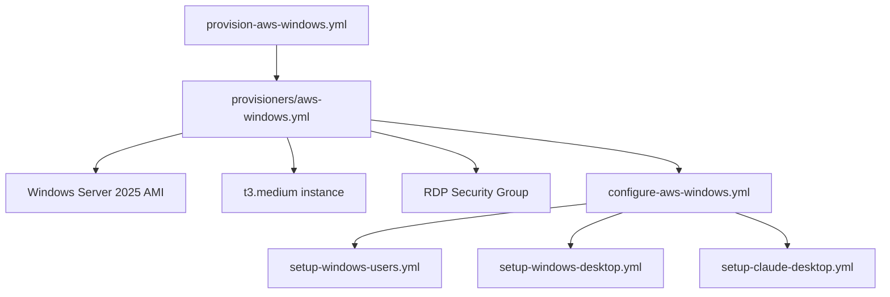

# System Patterns: Ansible All My Things

## Architecture Overview

### Layered Playbook Structure
```
provision-aws-windows.yml → provisioners/aws-windows.yml → configure-aws-windows.yml → playbooks/setup-windows-*.yml
```

**Separation of Concerns:**
- **Provision Layer**: AWS-specific Windows Server infrastructure creation
- **Configuration Layer**: Windows-specific system setup and application installation
- **Playbook Layer**: Specific functionality (users, desktop, Claude Desktop)

### Multi-Platform Pattern
Each platform follows identical structure but different implementations:
```
Linux (Working):   provision-aws.yml → configure-aws.yml → playbooks/setup-*.yml
Windows (Planned): provision-aws-windows.yml → configure-aws-windows.yml → playbooks/setup-windows-*.yml
```

## Key Technical Decisions

### Windows Server Implementation Strategy
**Foundation Reuse**: Extend proven AWS Linux patterns to Windows Server
- **Same AWS Infrastructure**: Reuse security groups, networking, tagging patterns
- **Different Configuration**: Windows-specific modules and approaches
- **Consistent Interface**: Same command patterns for provision/configure/destroy

### Windows-Specific Architecture Decisions
**Authentication Method**: WinRM instead of SSH
```yaml
# Windows connection configuration
ansible_connection: winrm
ansible_winrm_transport: basic
ansible_winrm_server_cert_validation: ignore
ansible_port: 5985
```

**User Management Strategy**: Windows Administrator model
- **Administrator**: Initial Windows admin user (equivalent to root)
- **Service Account**: Ansible service user for automation
- **Desktop User**: Standard user for Claude Desktop Application usage

**Package Management**: Chocolatey for automated software installation
```yaml
# Windows package installation pattern
- name: Install Claude Desktop via Chocolatey
  win_chocolatey:
    name: claude-desktop
    state: present
```

### Technical Specifications for Windows Server MVP

#### Instance Configuration
- **AMI**: Windows Server 2025 with Desktop Experience (latest)
- **Instance Type**: t3.large (4 vCPU, 8GB RAM)
- **Storage**: 50GB GP3 EBS
- **Region**: eu-north-1 (carbon footprint and latency optimization)

#### Network Configuration
- **Security Group**: Custom Windows security group
- **RDP Access**: Port 3389 from user's IP only
- **WinRM Access**: Ports 5985/5986 for Ansible
- **Outbound**: Full internet access for downloads

#### Authentication
- **Method**: Administrator password (stored in Ansible Vault)
- **RDP**: Standard Windows RDP client
- **Ansible**: WinRM with password authentication

## Component Relationships

### Windows Server Provisioning Flow


### AWS Infrastructure Reuse
**Shared Components** (from Linux implementation):
- AWS credentials and authentication
- Dynamic inventory plugin (`amazon.aws.aws_ec2`)
- Instance tagging and naming conventions
- Resource cleanup patterns

**Windows-Specific Components**:
- Windows Server AMI selection
- RDP security group (port 3389)
- Larger instance types (t3.medium minimum)
- Windows-specific configuration playbooks

## Critical Implementation Paths

### Windows Server Provisioning Pattern
```yaml
# provisioners/aws-windows.yml (planned)
- name: Create Windows Server instance
  amazon.aws.ec2_instance:
    name: "{{ instance_name }}-windows"
    image_id: "{{ windows_server_ami }}"
    instance_type: t3.medium
    security_groups:
      - "{{ security_group_rdp }}"
    user_data: |
      <powershell>
      # Enable WinRM for Ansible
      winrm quickconfig -q
      winrm set winrm/config/service '@{AllowUnencrypted="true"}'
      </powershell>
```

### Windows Configuration Pattern
```yaml
# playbooks/setup-claude-desktop.yml (planned)
- name: Install Chocolatey package manager
  win_chocolatey:
    name: chocolatey
    state: present

- name: Install Claude Desktop Application
  win_chocolatey:
    name: claude-desktop
    state: present

- name: Create desktop shortcut
  win_shortcut:
    src: "C:\\Program Files\\Claude Desktop\\claude.exe"
    dest: "C:\\Users\\Public\\Desktop\\Claude Desktop.lnk"
```

## Design Principles

### Windows Server Adaptation Principles
- **Consistency**: Same command patterns as Linux implementation
- **Reuse**: Leverage existing AWS infrastructure patterns
- **Simplicity**: Minimal Windows-specific configuration
- **Cost Awareness**: Optimize for intermittent usage patterns

### Security Model for Windows
- **RDP Access**: Restricted to user's IP address only
- **Windows Firewall**: Configured for minimal exposure
- **User Isolation**: Separate Administrator and standard user accounts
- **Credential Management**: Windows passwords via Ansible Vault

### Cost Optimization Strategy
- **On-Demand Usage**: Complete provision → use → destroy lifecycle
- **Instance Sizing**: t3.medium minimum for Windows Server GUI
- **Storage Optimization**: 50GB GP3 for cost-effectiveness
- **Usage Patterns**: Target 10-15 hours/week for ~$15/month cost

## Extension Points

### Windows Application Support
**Pattern for Additional Applications**:
1. Create `playbooks/setup-windows-[app].yml`
2. Use Chocolatey for automated installation where possible
3. Handle Windows-specific configuration requirements
4. Test via RDP for desktop application functionality

### Windows Development Environment
**Future Extensions**:
- Visual Studio installation and configuration
- .NET development environment setup
- Windows-specific development tools
- Git and development workflow setup

## Provider Differences Reference

| Aspect | AWS Linux (Working) | AWS Windows (Planned) |
|--------|--------------------|-----------------------|
| Connection | SSH (port 22) | WinRM (port 5985) + RDP (port 3389) |
| Default User | `ubuntu` | `Administrator` |
| Package Manager | APT | Chocolatey |
| Instance Type | t3.micro/small | t3.medium (minimum) |
| Storage | 20GB | 50GB |
| Desktop Access | SSH + X11 forwarding | RDP |
| Cost (monthly) | ~$8-10 | ~$15 |

## Windows-Specific Technical Requirements

### Ansible Collections
```yaml
# requirements.yml
collections:
  - name: ansible.windows
  - name: community.windows
  - name: amazon.aws
```

### Windows Server Configuration
- **Desktop Experience**: Enable GUI for desktop applications
- **WinRM Setup**: Configure Windows Remote Management for Ansible
- **PowerShell Execution Policy**: Allow script execution for automation
- **Windows Updates**: Configure automatic updates for security

### RDP Optimization
- **Performance Settings**: Optimize for desktop application responsiveness
- **Display Configuration**: Configure appropriate resolution and color depth
- **Audio Redirection**: Enable audio for applications that require it
- **Clipboard Sharing**: Enable clipboard between host and Windows Server
